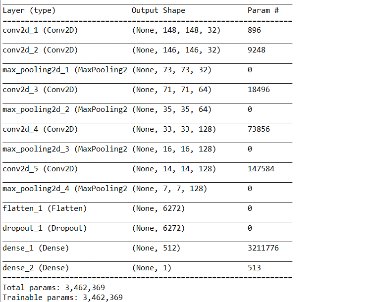
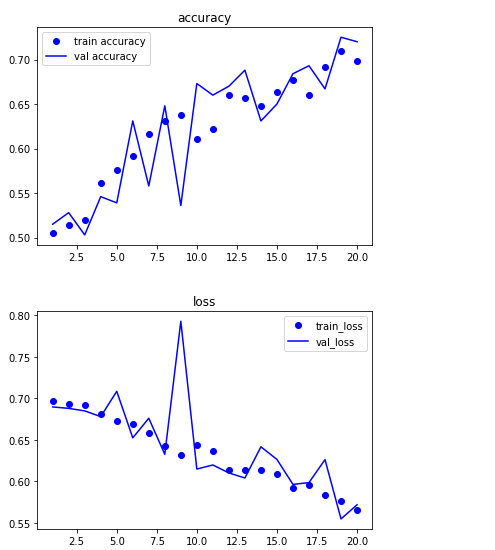
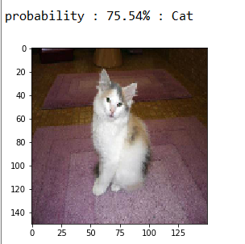
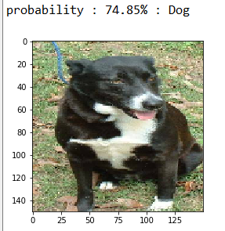
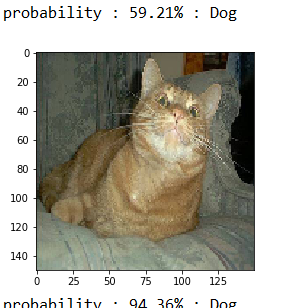

# mechinlearning-cat-vs-dog-keras-in-kaggle

2019 6/14~6/15

keras로 만든 Dogs vs. Cats 입니다.   
kaggle에서 데이터를 사용해주시기 바랍니다.     
https://www.kaggle.com/c/dogs-vs-cats/data   

# Data Augmentation
  image 모듈을 이용하여 ImageDataGenerator()을 사용, 데이터가 부족해 생기는 overfitting 문제를 어느정도 완화시키기 위해 사용했습니다.   
  데이터 전처리가 완료되면.npy에 담아두었습니다. 매번 전처리하는 문제를 막고, 모든 데이터셋을 메모리에 올리는 문제를 해결하기 위해 사용했습니다.   
# Checking Point
  향상된 결과를 내줄 때마다, 그 때의 가중치를 저장해 놓았습니다. 만약 향상된 결과를 내주지 않으면 결과를 저장하지 않습니다.   
# Modeling
   
  conv2d와 max_pooling이 반복되고, flatten을 통해서 7*7*128 = 6272를 만들었습니다. 그 후에 dropout을 통해서 가중치가 vanishing되는 문제를 해결하였고, dense를 통해서 입력 값과 가중치, 바이어스의 연산을 실행시켜주었습니다.   

# Result Graph
   
  20에폭의 학습이 완료되고 난 뒤의 그래프입니다. 전체적으로 accuracy는 점점 증가하고, loss값은 점점 하락하는 것이 보입니다.   
  
# Testing
 ,    

  다음과 같이 맞는 결과가 나오는 것도 있는 반면  
  
   
  정답이 아닌 경우도 있습니다.   
  
# 개선
   학교 수업과 coursera 강의를 듣고 만든 toy-project이기 때문에 완벽하지 않습니다. 추후 더 mechinelearning을 학습해 수정이 이루어질 예정입니다. 
